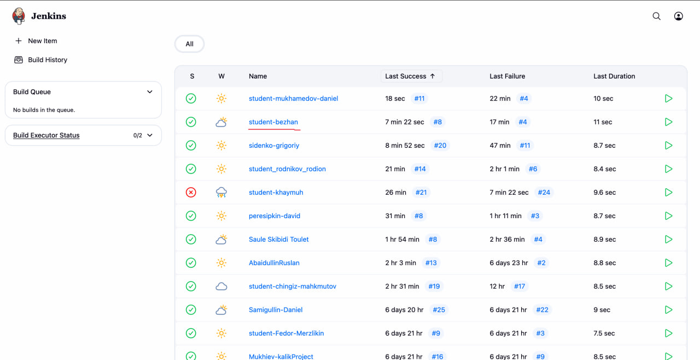
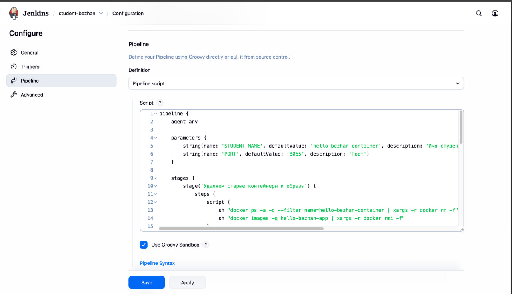
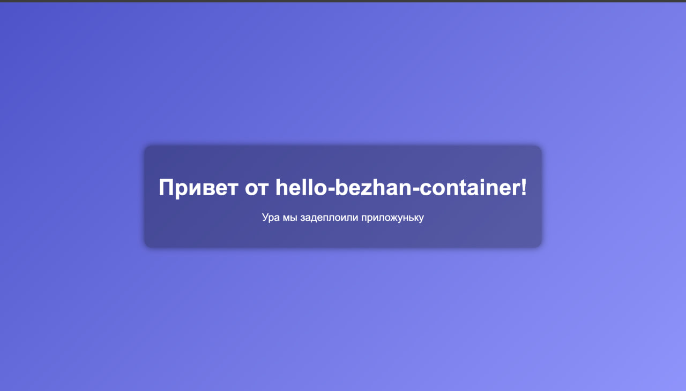
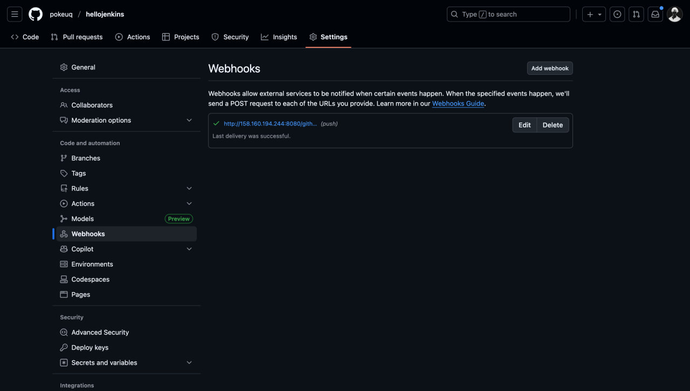
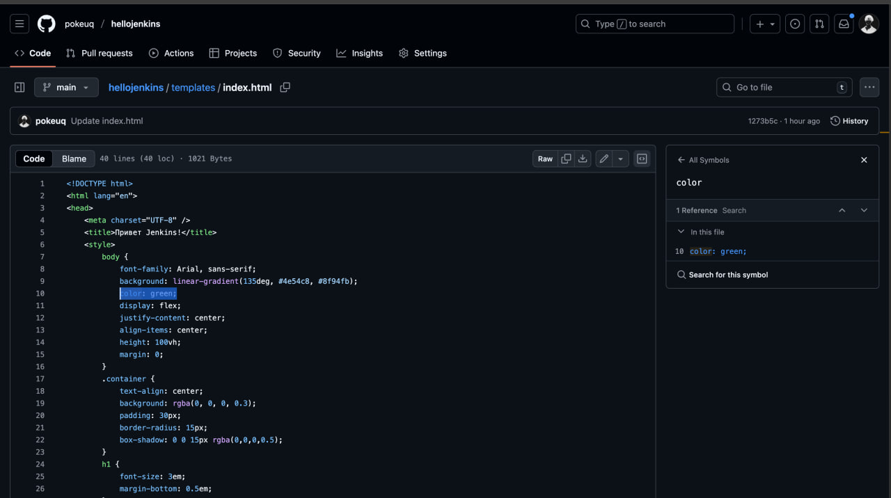

# laba2
## Хайриддинов Бежан ПИ-430Б
1. Авторизовались на Jenkins-сервере, создали новый проект - hello-bezhan-container.

2. Структура Jenkinsfile в нашем проекте. Меняем ссылку на нашу репу, некоторые части, порт и имя студента.

3. Переходим по ссылке: http://158.160.194.244:8065/ и видим

4. Далее вводим вебхук в настройках репозитория

5. Далее меняем код HTML в файле нашего репозитория

7. Смотри за изменениями на http://158.160.194.244:8051/

